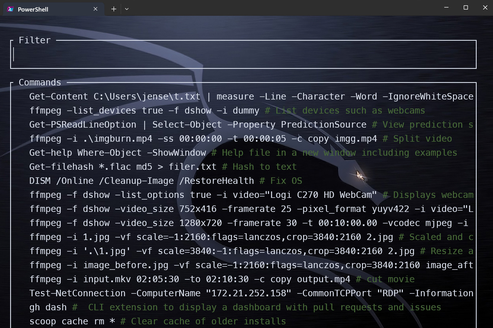
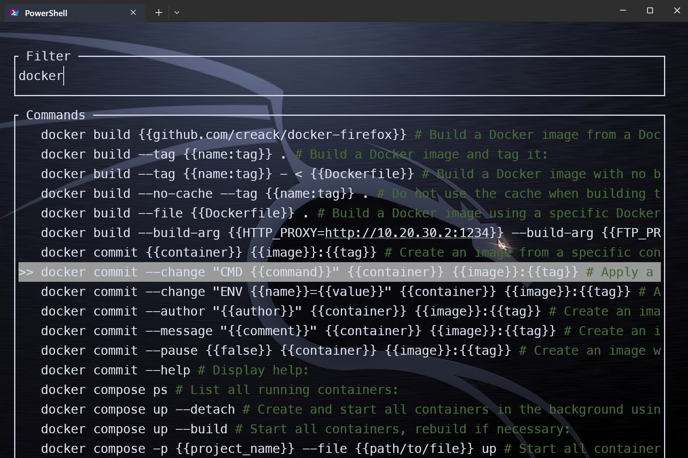

# IntelliShell

<!-- toc -->

IntelliShell bookmarks commands and includes tldr pages.

Press <kbd>Ctrl</kbd> + <kbd>Space</kbd> to list bookmarked commands.

 

Type the beginning of the command, for example `docker` and intelli-shell will fetch
a list of commands starting with `docker` from your bookmarked commands and [tldr](https://github.com/tldr-pages/tldr).  
Navigate with <kbd>↑</kbd> or <kbd>↓</kbd>. Select with <kbd>Enter</kbd>.

## Hotkeys

<kbd>ctrl</kbd> + <kbd>b</kbd> bookmark currently typed command

<kbd>ctrl</kbd> + <kbd>space</kbd> show suggestions for current line

<kbd>ctrl</kbd> + <kbd>l</kbd> replace labels of currently typed command (Linux)

<kbd>esc</kbd> clean current line, this binding can be skipped if INTELLI_SKIP_ESC_BIND=1

Note: When navigating items, selected suggestion can be deleted with <kbd>ctrl</kbd> + <kbd>d</kbd> or
edited with any of: <kbd>ctrl</kbd> + <kbd>e</kbd>, <kbd>ctrl</kbd> + <kbd>u</kbd> or <kbd>F2</kbd>

You can customize key bindings using environment variables: INTELLI_BOOKMARK_HOTKEY, INTELLI_SEARCH_HOTKEY and INTELLI_LABEL_HOTKEY

## Help

Usage: intelli-shell.exe [OPTIONS] <COMMAND>

|Commands:|Description|
|:---    |:---|
|new    | Stores a new user command |
|search | Opens a new search interface |
|label  | Opens a new label interface |
|export | Exports stored user commands |
|import | Imports user commands |
|fetch  | Fetches new commands from tldr |
|help   | Print this message or the help of the given subcommand(s) |

 

|Options:|Description|
|:---    |:---|
|-i, --inline                    | Whether the UI should be rendered inline instead of taking full terminal |
|    --inline-extra-line         | Whether an extra line should be rendered when inline |
|-f, --file-output <FILE_OUTPUT> | Path of an existing file to write the output to (defaults to stdout) |
|-h, --help                      | Print help |
|-V, --version                   | Print version |

More details on [IntelliShell](https://github.com/lasantosr/intelli-shell) and [tldr](https://github.com/tldr-pages/tldr).
