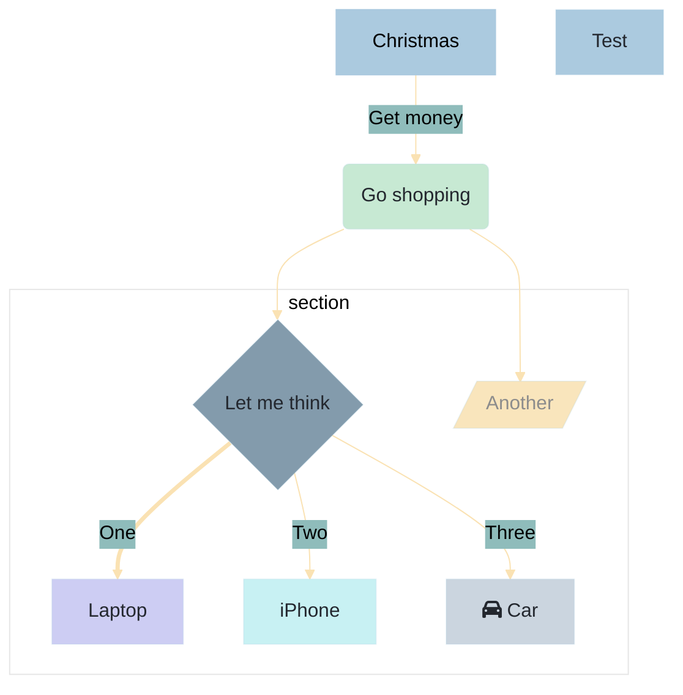
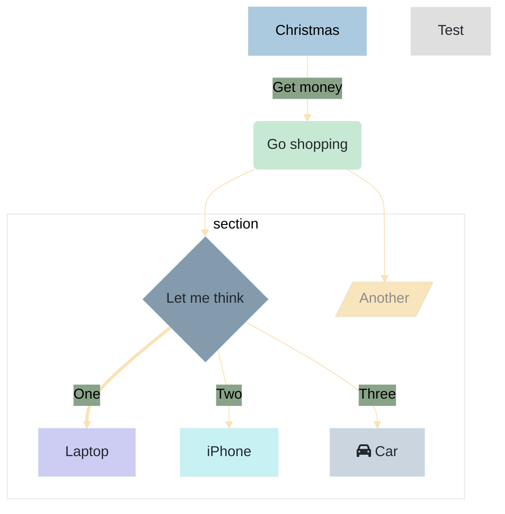

# mdBook Syntax  

<!-- toc -->

<br>

For more details see [mdBook docs](https://rust-lang.github.io/mdBook/)

## Change browser tab title

````plaintext
\{{#title New & improved}}
````

{{#title New & improved}}

## Rust Playground

````
```rust,editable
fn main() {
    let number = 5;
    print!("{}", number);
}
```
````

<br>

```rust,editable
// Editable Rust code. Edit and run code in the browser.
fn main() {
    let number = 5;
    print!("{}", number);
}
```

## MathJax support  

````plaintext  
\\[ \mu = \frac{1}{N} \sum_{i=0} x_i \\]
````  

\\[ \mu = \frac{1}{N} \sum_{i=0} x_i \\]

> [!NOTE]  
> The usual delimiters MathJax uses are not yet supported. You can’t currently
> use `$$ ... $$` as delimiters and the `\[ ... \]` delimiters need an extra backslash
> to work. Hopefully this limitation will be lifted soon.

<br>

## Embedify  

Get [mdBook-embedify](https://github.com/MR-Addict/mdbook-embedify) Embed videos, include banners, scroll-to-top and footer options.



</br>  

## Alerts

Modified and translated version of mdBook-alerts. English and Swedish. See options: [https://github.com/horbjorn/rs-mdbook-alerts](https://github.com/horbjorn/rs-mdbook-alerts)

> [!NOTERA]  
> Text

> [!TIPS]
> Annan text

> [!VIKTIGT]  
> ..nånting

> [!VARNING]  
> Se upp! 

> [!FARA]
> Lugn..  

Example:

````plaintext
 > [!NOTERA]  
 > Random text
````

<br>

mdBook's builtin version in html:  

```html
<div class="warning">

This is a bad thing that you should pay attention to.

Warning blocks should be used sparingly in documentation, to avoid "warning
fatigue," where people are trained to ignore them because they usually don't
matter for what they're doing.
</div> 
```

<div class="warning">

This is a bad thing that you should pay attention to.

Warning blocks should be used sparingly in documentation, to avoid "warning
fatigue," where people are trained to ignore them because they usually don't
matter for what they're doing.
</div>  

</br>

## Mermaid

[Mermaid Theme](https://mermaid.js.org/config/theming.html)  

[mdBook-mermaid](https://github.com/badboy/mdbook-mermaid)



<details>

<summary>Source code</summary>

````plaintext

````
</details>

<br>

<br>

</details>

## Tabs

Get [mdbook-tabs](https://github.com/RustForWeb/mdbook-plugins/tree/main/packages/mdbook-tabs)

```plaintext
{{#tabs }}
{{#tab name="Tab 1" }}
**Tab content 1**
{{#endtab }}
{{#tab name="Tab 2" }}
_Tab content 2_
{{#endtab }}
{{#tab name="Tab 3" }}
~~Tab content 3~~
{{#endtab }}
{{#endtabs }}
```

{{#tabs }}
{{#tab name="Tab 1" }}
**Tab content 1**
{{#endtab }}
{{#tab name="Tab 2" }}
_Tab content 2_
{{#endtab }}
{{#tab name="Tab 3" }}
~~Tab content 3~~
{{#endtab }}
{{#endtabs }}

<br>

### Global tabs

````plaintext
{{#tabs global="test" }}
{{#tab name="Rust" }}

```rust,noplayground  
fn main() {
println!("Hello World!");  
} 
```

{{#endtab }}
{{#tab name="HTML" }}

```html
<p style="text-align:center;">Essential Shortcuts</p>
```

{{#endtab }}
{{#tab name="CSS" }}

```css
.mdbook-tab {
    background-color: var(--table-alternate-bg);
    padding: 0.5rem 1rem;
    cursor: pointer;
    border: none;
    font-size: 1.6rem;
    line-height: 1.45em;
}
```

{{#endtab }}
{{#endtabs }}
````

> [!TIP]
> Paste the above code block twice into a document to create global tabs.

{{#tabs global="test" }}
{{#tab name="Rust" }}

```rust,noplayground  
fn main() {
println!("Hello World!");  
} 
```

{{#endtab }}
{{#tab name="HTML" }}

```html
<p style="text-align:center;">Essential Shortcuts</p>
```

{{#endtab }}
{{#tab name="CSS" }}

```css
.mdbook-tab {
    background-color: var(--table-alternate-bg);
    padding: 0.5rem 1rem;
    cursor: pointer;
    border: none;
    font-size: 1.6rem;
    line-height: 1.45em;
}
```

{{#endtab }}
{{#endtabs }}

{{#tabs global="test" }}
{{#tab name="Rust" }}

```rust,noplayground  
fn main() {
println!("Hello World!");  
} 
```

{{#endtab }}
{{#tab name="HTML" }}

```html
<p style="text-align:center;">Essential Shortcuts</p>
```

{{#endtab }}
{{#tab name="CSS" }}

```css
.mdbook-tab {
    background-color: var(--table-alternate-bg);
    padding: 0.5rem 1rem;
    cursor: pointer;
    border: none;
    font-size: 1.6rem;
    line-height: 1.45em;
}
```

{{#endtab }}
{{#endtabs }}

## Admonish

Install [admonish](https://github.com/tommilligan/mdbook-admonish)  

Examples:

````plaintext
```admonish
Some text
```
````

````plaintext
```admonish example
example
```
````

```admonish
Some text
```

```admonish example
example
```

```admonish tldr
abstract, summary, tldr
```

```admonish check
success, check, done
```

```admonish question
question, faq, help
```

```admonish info
info, todo
```

```admonish tip
tip, hint, important
```

```admonish warning
warning, caution, attention
```

```admonish fail
failure, fail, missing
```

```admonish danger
danger, error
```

```admonish bug
bug
```

```admonish quote
quote, cite
```

````plaintext
```admonish quote collapsible=true, title='A title that really <span style="color: #e70073">pops</span>'
To really <b><span style="color: #e70073">grab</span></b> your reader's attention.
```
````

```admonish quote collapsible=true, title='A title that really <span style="color: #e70073">pops</span>'
To really <b><span style="color: #e70073">grab</span></b> your reader's attention.
```
