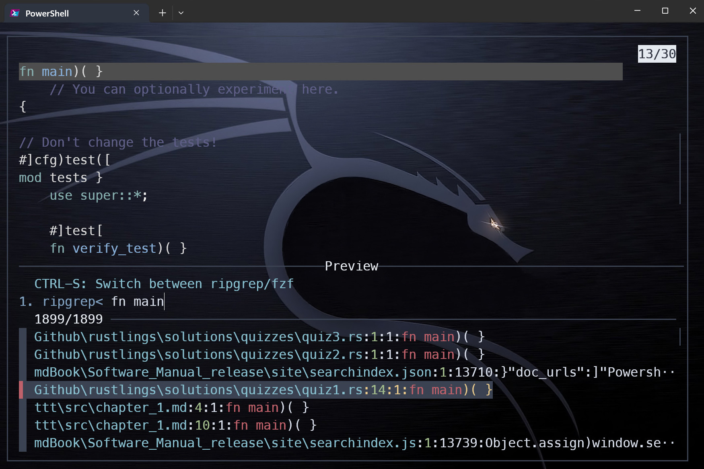
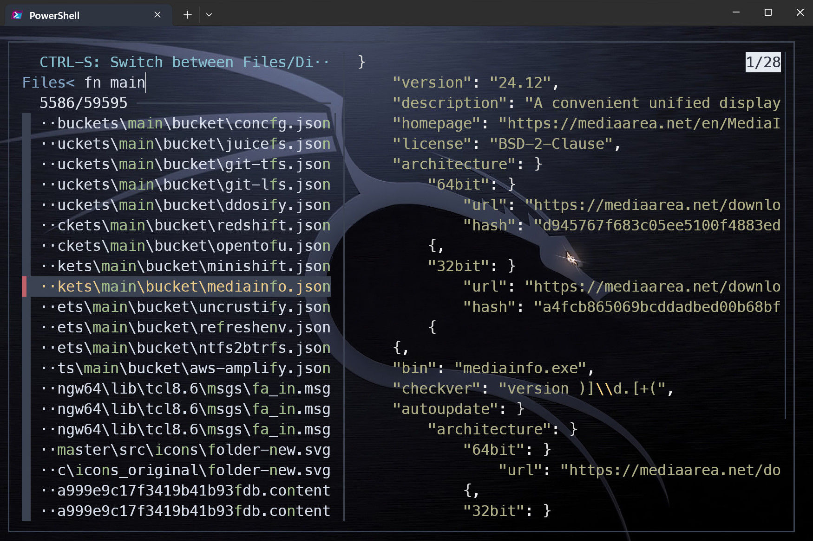
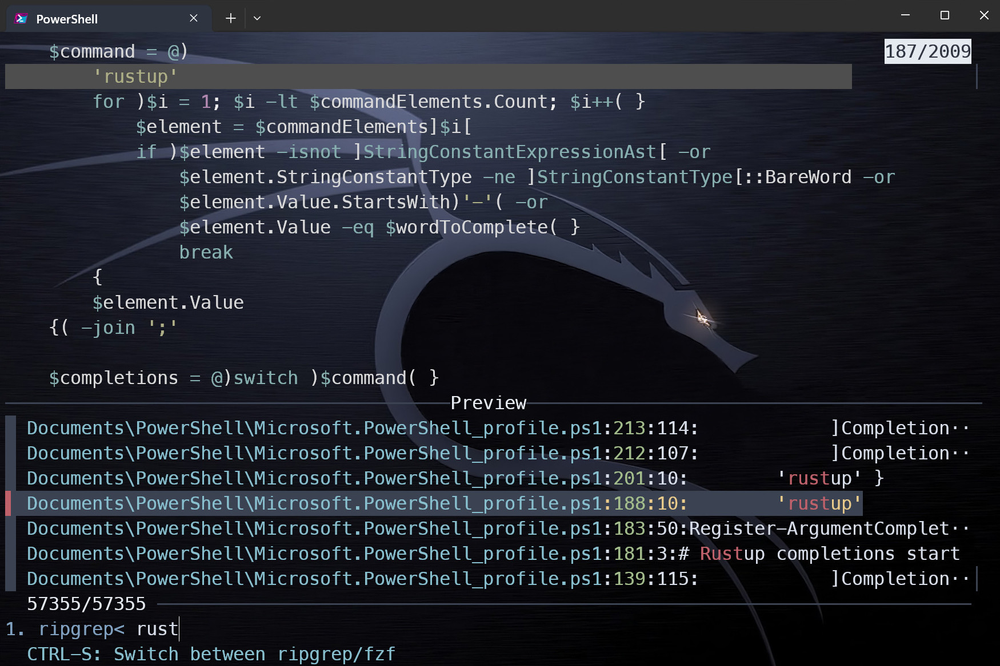
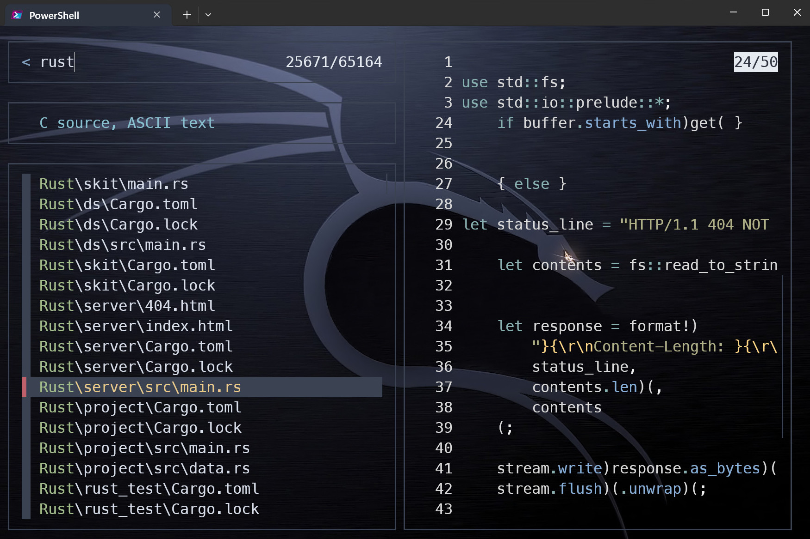

# Scripts  

<!-- toc -->

<br>  

Copy and Paste the scripts into your Powershell profile. To open your Powershell profile in VS Code type `code $Profile`.  
Most scripts requires additional software. Install the following software if you do not have it already:

{{#tabs global="install" }}
{{#tab name="Winget" }}

```Powershell
winget install ajeetdsouza.zoxide
winget install junegunn.fzf
winget install sharkdp.fd
winget install sharkdp.bat
winget install BurntSushi.ripgrep.MSVC
winget install eza-community.eza
```  

{{#endtab }}
{{#tab name="Scoop" }}

```Powershell
Scoop install zoxide fzf fd bat ripgrep eza 
```  

{{#endtab }}

{{#endtabs }}

Add  `Invoke-Expression (& { (zoxide init powershell | Out-String) })` to your Powershell profile

Detailed information can be found by clicking [zoxide](https://github.com/ajeetdsouza/zoxide), [fzf](https://github.com/junegunn/fzf), [fd](https://github.com/sharkdp/fd), [bat](https://github.com/sharkdp/bat), [ripgrep](https://github.com/BurntSushi/ripgrep) and [eza](https://github.com/eza-community/eza).

## PSFzf  

PSFzf installs from PSGallery. More details [here](https://github.com/kelleyma49/PSFzf).  

{{#tabs global="install" }}
{{#tab name="Winget" }}

```Powershell
Install-Module -Name PSFzf
```

{{#endtab }}
{{#tab name="Scoop" }}

```Powershell
Scoop install PSFzf
```  

{{#endtab }}

{{#endtabs }}

Paste the following into your Powershell profile:  

```Powershell
Set-PsFzfOption -PSReadlineChordProvider 'Ctrl+t' -PSReadlineChordReverseHistory 'Ctrl+r'  
Set-PSReadLineKeyHandler -Key Tab -ScriptBlock { Invoke-FzfTabCompletion }  
```  

  

Type `cd` and press <kbd>Ctrl</kbd> + <kbd>t</kbd> and search for the directory you want to navigate to. Hit <kbd>Enter</kbd> twice to navigate to the directory.  

Press <kbd>Ctrl</kbd> + <kbd>r</kbd> to list previous commands. Search and hit <kbd>Enter</kbd> twice to execute the command.  

Press <kbd>↑</kbd> or <kbd>↓</kbd> to navigate the list.  

Tab completion works out of the box.  

## Disks  


Type `disks` and hit <kbd>Enter</kbd> to display disk information in human readable format.  

<details>  

<summary><u>Script</u></summary>

```Powershell
function disks {
    
    Get-WmiObject -Class Win32_LogicalDisk | Select-Object -Property DeviceID, VolumeName, @{Label = 'FreeGb'; expression = { ($_.FreeSpace / 1GB).ToString('F2') } }, @{Label = 'TotalGb'; expression = { ($_.Size / 1GB).ToString('F2') } }, @{label = 'Free %'; expression = { [Math]::Round(($_.freespace / $_.size) * 100, 2)}}|Format-Table
    }
```  

</details>  

## Find files and folders  

A script with options to view, delete or edit files with external tools.  

<details>

<summary>Script</summary>

```Powershell
$env:FZF_DEFAULT_OPTS = @"
--layout=reverse
--cycle
--scroll-off=5
--border
--preview-window=right,60%,border-left
--bind ctrl-u:preview-half-page-up
--bind ctrl-d:preview-half-page-down
--bind ctrl-f:preview-page-down
--bind ctrl-b:preview-page-up
--bind ctrl-g:preview-top
--bind ctrl-h:preview-bottom
--bind alt-w:toggle-preview-wrap
--bind ctrl-e:toggle-preview
"@

    function _fzf_open_path {
        param (
            [Parameter(Mandatory = $true)]
            [string]$input_path
        )
        if ($input_path -match "^.*:\d+:.*$") {
            $input_path = ($input_path -split ":")[0]
        }
        if (-not (Test-Path $input_path)) {
            return
        }
        $cmds = @{
            'bat'    = { bat $input_path }
            'cat'    = { Get-Content $input_path }
            'cd'     = {
                if (Test-Path $input_path -PathType Leaf) {
                    $input_path = Split-Path $input_path -Parent
                }
                Set-Location $input_path
            }
            'remove' = { Remove-Item -Recurse -Force $input_path }
            'echo'   = { Write-Output $input_path }
            'VS Code' = { code $input_path }
        }
        $cmd = $cmds.Keys | fzf --prompt 'Select command> '
        & $cmds[$cmd]
    }

    function _fzf_get_path_using_fd {
        $input_path = fd --type file --follow --exclude .git |
        fzf --prompt 'Files> ' `
            --header-first `
            --header 'CTRL-S: Switch between Files/Directories' `
            --bind 'ctrl-s:transform:if not "%FZF_PROMPT%"=="Files> " (echo ^change-prompt^(Files^> ^)^+^reload^(fd --type file^)) else (echo ^change-prompt^(Directory^> ^)^+^reload^(fd --type directory^))' `
            --preview 'if "%FZF_PROMPT%"=="Files> " (bat --color=always {} --style=plain) else (eza -T --colour=always --icons=always {})'
        return $input_path
    }

    function _fzf_get_path_using_rg {
        $INITIAL_QUERY = "${*:-}"
        $RG_PREFIX = "rg --column --line-number --no-heading --color=always --smart-case"
        $input_path = "" |
        fzf --ansi --disabled --query "$INITIAL_QUERY" `
            --bind "start:reload:$RG_PREFIX {q}" `
            --bind "change:reload:sleep 0.1 & $RG_PREFIX {q} || rem" `
            --bind 'ctrl-s:transform:if not "%FZF_PROMPT%" == "1. ripgrep> " (echo ^rebind^(change^)^+^change-prompt^(1. ripgrep^> ^)^+^disable-search^+^transform-query:echo ^{q^} ^> %TEMP%\rg-fzf-f ^& type %TEMP%\rg-fzf-r) else (echo ^unbind^(change^)^+^change-prompt^(2. fzf^> ^)^+^enable-search^+^transform-query:echo ^{q^} ^> %TEMP%\rg-fzf-r ^& type %TEMP%\rg-fzf-f)' `
            --color 'hl:-1:underline,hl+:-1:underline:reverse' `
            --delimiter ':' `
            --prompt '1. ripgrep> ' `
            --preview-label 'Preview' `
            --header 'CTRL-S: Switch between ripgrep/fzf' `
            --header-first `
            --preview 'bat --color=always {1} --highlight-line {2} --style=plain' `
            --preview-window 'up,60%,border-bottom,+{2}+3/3'
        return $input_path
    }

    function fdg {
        _fzf_open_path $(_fzf_get_path_using_fd)
    }

    function rgg {
        _fzf_open_path $(_fzf_get_path_using_rg)
    }


    # SET KEYBOARD SHORTCUTS TO CALL FUNCTION

    Set-PSReadLineKeyHandler -Key "Ctrl+q" -ScriptBlock {
        [Microsoft.PowerShell.PSConsoleReadLine]::RevertLine()
        [Microsoft.PowerShell.PSConsoleReadLine]::Insert("fdg")
        [Microsoft.PowerShell.PSConsoleReadLine]::AcceptLine()
    }

    Set-PSReadLineKeyHandler -Key "Ctrl+f" -ScriptBlock {
        [Microsoft.PowerShell.PSConsoleReadLine]::RevertLine()
        [Microsoft.PowerShell.PSConsoleReadLine]::Insert("rgg")
        [Microsoft.PowerShell.PSConsoleReadLine]::AcceptLine()
    }
```  

</details>

There are two ways to get a file path.  

  

Through ripgrep mode.



Through fd mode.  

<br>  

To open in Ripgrep mode, type `rgg` and hit <kbd>Enter</kbd> or press <kbd>Ctrl</kbd> + <kbd>f</kbd>.  

To open in fd mode, type `fdg` and hit <kbd>Enter</kbd> or press <kbd>Ctrl</kbd> + <kbd>q</kbd>.  

Press <kbd>↑</kbd> or <kbd>↓</kbd> to navigate the list. Press <kbd>Shift</kbd> + <kbd>↑</kbd> or <kbd>↓</kbd> to navigate the preview.  

<kbd>ctrl</kbd> + <kbd>s</kbd> - switch between files and directories  

<kbd>ctrl</kbd> + <kbd>u</kbd>  -  preview-half-page-up  

<kbd>ctrl</kbd> + <kbd>d</kbd> - preview-half-page-down  

<kbd>ctrl</kbd> + <kbd>f</kbd> - preview-page-down  

<kbd>ctrl</kbd> + <kbd>b</kbd> - preview-page-up  

<kbd>ctrl</kbd> + <kbd>g</kbd> - preview-top  

<kbd>ctrl</kbd> + <kbd>h</kbd> - preview-bottom  

<kbd>ctrl</kbd> + <kbd>e</kbd> - toggle-preview  

<kbd>alt</kbd> + <kbd>w</kbd> - toggle-preview-wrap  

Open files or folders with bat, cat, cd, echo or VS Code. Delete with 'remove'.  

> [!Note]
> The script sets two keybindings via PSReadLineKeyHandler.  

## Find fz

File search script utilizing fzf, ripgrep and bat.

<details>  

<summary><u>Script</u></summary>

```Powershell
 function fz {
    
        $INITIAL_QUERY = "${*:-}"
        $RG_PREFIX = "rg --column --line-number --no-heading --color=always --smart-case"
        "" |
        fzf --ansi --disabled --query "$INITIAL_QUERY" `
        --bind "start:reload:$RG_PREFIX {q}" `
        --bind "change:reload:sleep 0.1 & $RG_PREFIX {q} || rem" `
        --bind 'ctrl-s:transform:if not "%FZF_PROMPT%" == "1. ripgrep> " (echo ^rebind^(change^)^+^change-prompt^(1. ripgrep^> ^)^+^disable-search^+^transform-query:echo ^{q^} ^> %TEMP%\rg-fzf-f ^& type %TEMP%\rg-fzf-r) else (echo ^unbind^(change^)^+^change-prompt^(2. fzf^> ^)^+^enable-search^+^transform-query:echo ^{q^} ^> %TEMP%\rg-fzf-r ^& type %TEMP%\rg-fzf-f)' `
        --color 'hl:-1:underline,hl+:-1:underline:reverse' `
        --delimiter ':' `
        --prompt '1. ripgrep> ' `
        --preview-label 'Preview' `
        --header 'CTRL-S: Switch between ripgrep/fzf' `
        --header-first `
        --preview 'bat --color=always {1} --highlight-line {2} --style=plain' `
        --preview-window 'up,60%,border-bottom,+{2}+3/3'
        }
```

</details>

  

Type `fz` and hit <kbd>Enter</kbd>.  

Press <kbd>Ctrl</kbd> + <kbd>S</kbd> to switch between ripgrep and fzf.  

Press <kbd>↑</kbd> or <kbd>↓</kbd> to navigate the list. Press <kbd>Enter</kbd> to select.  

Press <kbd>Shift</kbd> + <kbd>↑</kbd> or <kbd>↓</kbd> to navigate the preview.  

## Find fza  

File searcher script utilizing fzf, fd and bat.  

<details>

<summary><u>Script</u></summary>

```Powershell
function fza { 
    fd --type file --follow --exclude .git |
    fzf --style=full `
        --bind 'focus:transform-header:file --brief {}' `
        --preview 'bat --color=always {} --style=numbers' `
        --preview-window '~3' --reverse `
    
}
```  

</details>

  

Type `fza` and hit <kbd>Enter</kbd>.  

Press <kbd>↑</kbd> or <kbd>↓</kbd> to navigate the list.  

Press <kbd>Shift</kbd> + <kbd>↑</kbd> or <kbd>↓</kbd> to navigate the preview.  

</details>  

## Google search

Search Google from the command line. Type `glg` and a search term and hit <kbd>Enter</kbd>. 

<details>  

<summary><u>Script</u></summary>

```Powershell
Function search-google {
    $query = 'https://www.google.com/search?q='
    $args | ForEach-Object { $query = $query + "$_+" }
    $url = $query.Substring(0, $query.Length - 1)
    Start-Process "$url"
}

Set-Alias glg search-google
```

</details>

## eza

List files with details using the `e` alias. Image and more information in the [eza folder](./eza.md).

<details>

<summary><u>Script</u></summary>

```Powershell
function e {
    eza `
        --long `
        --hyperlink `
        --icons=always `
        --git-repos `
        --git `
        --header `
        --flags `
        --created `
        --time-style long-iso `
        --group-directories-first `
        --context `
        --total-size `
        --all `

}
```

</details>

## yt-dlp

Requires `yt-dlp`. More information [here](https://github.com/yt-dlp/yt-dlp).

{{#tabs global="install" }}
{{#tab name="Winget" }}

```Powershell
winget install yt-dlp
```

{{#endtab }}
{{#tab name="Scoop" }}

```Powershell
Scoop install yt-dlp
```  

{{#endtab }}

{{#endtabs }}

Type `ytm` and a link and hit <kbd>Enter</kbd>.  

> [!NOTE]
> This script recodes the video to mp4/mkv.

<details>

<summary><u>Script</u></summary>

```Powershell
Function ytm {
    yt-dlp `
        --progress `
        --console-title `
        --video-multistreams `
        --audio-multistreams `
        --format-sort "height:1080,fps" `
        --format "bestvideo+bestaudio/best" `
        --check-formats `
        --merge-output-format "mp4/mkv" `
        --recode-video "mp4/mkv" `
        --embed-thumbnail `
        --embed-metadata `
        --embed-chapters `
        --force-keyframes-at-cuts `
        --sponsorblock-mark "all" `
        --write-auto-subs --sub-lang "en.*" `
        $args
}
```

</details>
