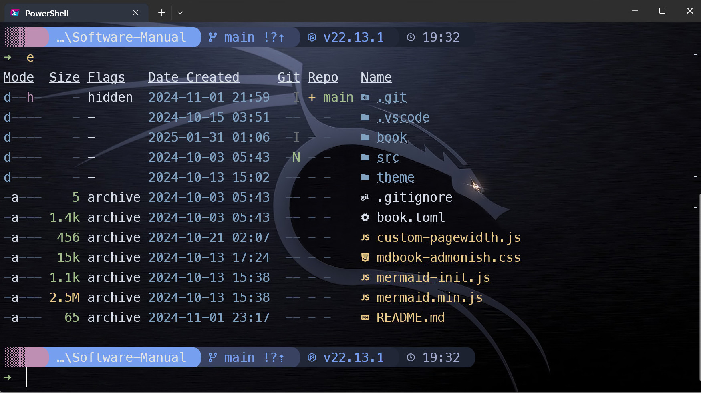

# Tools

<!-- toc -->

## Yazi  

Tabbed file manager with preview supporting numerous file types.  

The install instructions are [here](https://yazi-rs.github.io/docs/installation). Don't forget to add the shell wrapper.  [Plugins](https://github.com/yazi-rs/plugins/tree/main) are also available.  

Add a shortcut `!` to drop to the shell in current directory. Type `exit` to return to yazi. Add this keybinding to your keymap.toml` file:

```toml
[[manager.prepend_keymap]]
on   = "!"
run  = 'shell "pwsh.exe" --block'
desc = "Open PowerShell here"
```

[mpv](https://mpv.io/installation/) for video playback is recommended. Edit yazi.toml accordingly.  

  

<details>  

<summary><u>Shortcuts</u></summary>

**Navigation**  

To navigate between files and directories you can use the arrow keys <kbd>←</kbd>, <kbd>↓</kbd>, <kbd>↑</kbd> and <kbd>→</kbd> or Vim-like keys such as <kbd>h</kbd>, <kbd>j</kbd>, <kbd>k</kbd>, <kbd>l</kbd>:

| Key binding  | Alternate key | Action                                          |
| ------------ | ------------- | ----------------------------------------------- |
| <kbd>k</kbd> | <kbd>↑</kbd>  | Move the cursor up                              |
| <kbd>j</kbd> | <kbd>↓</kbd>  | Move the cursor down                            |
| <kbd>l</kbd> | <kbd>→</kbd>  | Enter hovered directory                         |
| <kbd>h</kbd> | <kbd>←</kbd>  | Leave the current directory and into its parent |

Further navigation commands can be found in the table below.

| Key binding                 | Action                                         |
| --------------------------- | ---------------------------------------------- |
| <kbd>K</kbd>                | Seek up 5 units in the preview                 |
| <kbd>J</kbd>                | Seek down 5 units in the preview               |
| <kbd>g</kbd> ⇒ <kbd>g</kbd> | Move cursor to the top                         |
| <kbd>G</kbd>                | Move cursor to the bottom                      |
| <kbd>z</kbd>                | Jump to a directory using zoxide               |
| <kbd>Z</kbd>                | Jump to a directory or reveal a file using fzf |

**Selection**  

To select files and directories, the following commands are available.

| Key binding                    | Action                                     |
| ------------------------------ | ------------------------------------------ |
| <kbd>Space</kbd>               | Toggle selection of hovered file/directory |
| <kbd>v</kbd>                   | Enter visual mode (selection mode)         |
| <kbd>V</kbd>                   | Enter visual mode (unset mode)             |
| <kbd>Ctrl</kbd> + <kbd>a</kbd> | Select all files                           |
| <kbd>Ctrl</kbd> + <kbd>r</kbd> | Inverse selection of all files             |
| <kbd>Esc</kbd>                 | Cancel selection                           |

**File operations**  

To interact with selected files/directories use any of the commands below.

| Key binding                         | Action                                                                  |
| ----------------------------------- | ----------------------------------------------------------------------- |
| <kbd>o</kbd>                        | Open selected files                                                     |
| <kbd>O</kbd>                        | Open selected files interactively                                       |
| <kbd>Enter</kbd>                    | Open selected files                                                     |
| <kbd>Shift</kbd> + <kbd>Enter</kbd> | Open selected files interactively (some terminals don't support it yet) |
| <kbd>Tab</kbd>                      | Show the file information                                               |
| <kbd>y</kbd>                        | Yank selected files (copy)                                              |
| <kbd>x</kbd>                        | Yank selected files (cut)                                               |
| <kbd>p</kbd>                        | Paste yanked files                                                      |
| <kbd>P</kbd>                        | Paste yanked files (overwrite if the destination exists)                |
| <kbd>Y</kbd> or <kbd>X</kbd>        | Cancel the yank status                                                  |
| <kbd>d</kbd>                        | Trash selected files                                                    |
| <kbd>D</kbd>                        | Permanently delete selected files                                       |
| <kbd>a</kbd>                        | Create a file (ends with / for directories)                             |
| <kbd>r</kbd>                        | Rename selected file(s)                                                 |
| <kbd>.</kbd>                        | Toggle the visibility of hidden files                                   |

Further file operation commands can be found in the table below.

| Key binding                    | Action                                     |
| ------------------------------ | ------------------------------------------ |
| <kbd>;</kbd>                   | Run a shell command                        |
| <kbd>:</kbd>                   | Run a shell command (block until finishes) |
| <kbd>-</kbd>                   | Symlink the absolute path of yanked files  |
| <kbd>_</kbd>                   | Symlink the relative path of yanked files  |
| <kbd>Ctrl</kbd> + <kbd>-</kbd> | Hardlink yanked files                      |

**Copy paths**  

To copy paths, use any of the following commands below.

*Observation: <kbd>c</kbd> ⇒ <kbd>d</kbd> indicates pressing the <kbd>c</kbd> key followed by pressing the <kbd>d</kbd> key.*

| Key binding                 | Action                              |
| --------------------------- | ----------------------------------- |
| <kbd>c</kbd> ⇒ <kbd>c</kbd> | Copy the file path                  |
| <kbd>c</kbd> ⇒ <kbd>d</kbd> | Copy the directory path             |
| <kbd>c</kbd> ⇒ <kbd>f</kbd> | Copy the filename                   |
| <kbd>c</kbd> ⇒ <kbd>n</kbd> | Copy the filename without extension |

**Filter files**  

| Key binding  | Action       |
| ------------ | ------------ |
| <kbd>f</kbd> | Filter files |

**Find files**  

| Key binding  | Action                   |
| ------------ | ------------------------ |
| <kbd>/</kbd> | Find next file           |
| <kbd>?</kbd> | Find previous file       |
| <kbd>n</kbd> | Go to the next found     |
| <kbd>N</kbd> | Go to the previous found |

**Search files**  

| Key binding                    | Action                                                                         |
| ------------------------------ | ------------------------------------------------------------------------------ |
| <kbd>s</kbd>                   | Search files by name using [fd](https://github.com/sharkdp/fd)                 |
| <kbd>S</kbd>                   | Search files by content using [ripgrep](https://github.com/BurntSushi/ripgrep) |
| <kbd>Ctrl</kbd> + <kbd>s</kbd> | Cancel the ongoing search                                                      |

**Sorting**  

To sort files/directories use the following commands.

*Observation: <kbd>,</kbd> ⇒ <kbd>a</kbd> indicates pressing the <kbd>,</kbd> key followed by pressing the <kbd>a</kbd> key.*

| Key binding                 | Action                           |
| --------------------------- | -------------------------------- |
| <kbd>,</kbd> ⇒ <kbd>m</kbd> | Sort by modified time            |
| <kbd>,</kbd> ⇒ <kbd>M</kbd> | Sort by modified time (reverse)  |
| <kbd>,</kbd> ⇒ <kbd>b</kbd> | Sort by birth time               |
| <kbd>,</kbd> ⇒ <kbd>B</kbd> | Sort by birth time (reverse)     |
| <kbd>,</kbd> ⇒ <kbd>e</kbd> | Sort by file extension           |
| <kbd>,</kbd> ⇒ <kbd>E</kbd> | Sort by file extension (reverse) |
| <kbd>,</kbd> ⇒ <kbd>a</kbd> | Sort alphabetically              |
| <kbd>,</kbd> ⇒ <kbd>A</kbd> | Sort alphabetically (reverse)    |
| <kbd>,</kbd> ⇒ <kbd>n</kbd> | Sort naturally                   |
| <kbd>,</kbd> ⇒ <kbd>N</kbd> | Sort naturally (reverse)         |
| <kbd>,</kbd> ⇒ <kbd>s</kbd> | Sort by size                     |
| <kbd>,</kbd> ⇒ <kbd>S</kbd> | Sort by size (reverse)           |
| <kbd>,</kbd> ⇒ <kbd>r</kbd> | Sort randomly                    |

**Multi-tab**  

| Key binding                                   | Action                             |
| --------------------------------------------- | ---------------------------------- |
| <kbd>t</kbd>                                  | Create a new tab with CWD          |
| <kbd>1</kbd>, <kbd>2</kbd>, ..., <kbd>9</kbd> | Switch to the N-th tab             |
| <kbd>[</kbd>                                  | Switch to the previous tab         |
| <kbd>]</kbd>                                  | Switch to the next tab             |
| <kbd>{</kbd>                                  | Swap current tab with previous tab |
| <kbd>}</kbd>                                  | Swap current tab with next tab     |
| <kbd>Ctrl</kbd> + <kbd>c</kbd>                | Close the current tab              |

</details>  

## ripgrep  

ripgrep is a line-oriented search tool that recursively searches the current directory for a regex pattern.  

Common options for ripgrep:  

<details>

<summary><u>Click to expand</u></summary>

- `-i --ignore-case`: When searching for a pattern, ignore case differences. That is `rg -i fast` matches `fast`, `fASt`, `FAST`, etc.  

- `-S --smart-case`: This is similar to `--ignore-case`, but disables itself if the pattern contains any uppercase letters. Usually this flag is put into alias or a config file.  

- `-F --fixed-strings`: Disable regular expression matching and treat the pattern as a literal string.  

- `-w --word-regexp`: Require that all matches of the pattern be surrounded by word boundaries. That is, given `pattern`, the `--word-regexp` flag will cause ripgrep to behave as if `pattern` were actually `\b(?:pattern)\b`.  

- `-c --count`: Report a count of total matched lines.  

- `-l --files-with-matches`: Only print the names of files that contain matches.  

- `--files-without-match`: Only print the names of files that do not contain matches.  

- `--files`: Print the files that ripgrep *would* search, but don't actually search them.  

- `-a --text`: Search binary files as if they were plain text.  

- `-U --multiline`: Permit matches to span multiple lines.  

- `-z --search-zip`: Search compressed files (gzip, bzip2, lzma, xz, lz4, brotli, zstd). This is disabled by default.  

- `-C --context`: Show the lines surrounding a match.  

- `--sort path`: Force ripgrep to sort its output by file name. (This disables parallelism, so it might be slower.)  

- `-L --follow`: Follow symbolic links while recursively searching.  

- `-M --max-columns`: Limit the length of lines printed by ripgrep.  

- `--debug`: Shows ripgrep's debug output. This is useful for understanding why a particular file might be ignored from search, or what kinds of configuration ripgrep is loading from the environment.  

</details>  

More details can be found <a href="https://github.com/BurntSushi/ripgrep" target="blank">here</a>  

# eza  

eza is a modern replacement for ls, with a focus on speed and ease of use.  

<https://github.com/eza-community/eza/tree/main/man>  



<details>

<summary><u>Options</u></summary>

SYNOPSIS

`eza [options] [files...]`

**eza** is a modern replacement for `ls`. It uses colours for information by default, helping you distinguish between many types of files, such as whether you are the owner, or in the owning group.

It also has extra features not present in the original `ls`, such as viewing the Git status for a directory, or recursing into directories with a tree view.

EXAMPLES

`eza` : Lists the contents of the current directory in a grid.

`eza --oneline --reverse --sort=size` : Displays a list of files with the largest at the top.

`eza --long --header --inode --git` : Displays a table of files with a header, showing each file’s metadata, inode, and Git status.

`eza --long --tree --level=3` : Displays a tree of files, three levels deep, as well as each file’s metadata.

META OPTIONS

`--help` : Show list of command-line options.

`-v`, `--version` : Show version of eza.

DISPLAY OPTIONS

`-1`, `--oneline` : Display one entry per line.

`-F`, `--classify=WHEN` : Display file kind indicators next to file names.

Valid settings are ‘`always`’, ‘`automatic`’ (or ‘`auto`’ for short), and ‘`never`’. The default value is ‘`automatic`’.

The default behavior (`automatic` or `auto`) will display file kind indicators only when the standard output is connected to a real terminal. If `eza` is ran while in a `tty`, or the output of `eza` is either redirected to a file or piped into another program, file kind indicators will not be used. Setting this option to ‘`always`’ causes `eza` to always display file kind indicators, while ‘`never`’ disables the use of file kind indicators.

`-G`, `--grid` : Display entries as a grid (default).

`-l`, `--long` : Display extended file metadata as a table.

`-R`, `--recurse` : Recurse into directories.

`-T`, `--tree` : Recurse into directories as a tree.

`--follow-symlinks` : Drill down into symbolic links that point to directories.

`-X`, `--dereference` : Dereference symbolic links when displaying information.

`-x`, `--across` : Sort the grid across, rather than downwards.

`--color=WHEN`, `--colour=WHEN` : When to use terminal colours (using ANSI escape code to colorize the output).

Valid settings are ‘`always`’, ‘`automatic`’ (or ‘`auto`’ for short), and ‘`never`’. The default value is ‘`automatic`’.

The default behavior (‘`automatic`’ or ‘`auto`’) is to colorize the output only when the standard output is connected to a real terminal. If the output of `eza` is redirected to a file or piped into another program, terminal colors will not be used. Setting this option to ‘`always`’ causes `eza` to always output terminal color, while ‘`never`’ disables the use of terminal color.

Manually setting this option overrides `NO_COLOR` environment.

`--color-scale`, `--colour-scale` : highlight levels of `field` distinctly. Use comma(,) separated list of all, age, size

`--color-scale-mode`, `--colour-scale-mode` : Use gradient or fixed colors in `--color-scale`.

Valid options are `fixed` or `gradient`. The default value is `gradient`.

`--icons=WHEN` : Display icons next to file names.

Valid settings are ‘`always`’, ‘`automatic`’ (‘`auto`’ for short), and ‘`never`’. The default value is ‘`automatic`’.

`automatic` or `auto` will display icons only when the standard output is connected to a real terminal. If `eza` is ran while in a `tty`, or the output of `eza` is either redirected to a file or piped into another program, icons will not be used. Setting this option to ‘`always`’ causes `eza` to always display icons, while ‘`never`’ disables the use of icons.

`--no-quotes` : Don't quote file names with spaces.

`--hyperlink` : Display entries as hyperlinks

`-w`, `--width=COLS` : Set screen width in columns.

FILTERING AND SORTING OPTIONS

`-a`, `--all` : Show hidden and “dot” files. Use this twice to also show the ‘`.`’ and ‘`..`’ directories.

`-A`, `--almost-all` : Equivalent to --all; included for compatibility with `ls -A`.

`-d`, `--list-dirs` : List directories as regular files, rather than recursing and listing their contents.

`-L`, `--level=DEPTH` : Limit the depth of recursion.

`-r`, `--reverse` : Reverse the sort order.

`-s`, `--sort=SORT_FIELD` : Which field to sort by.

Valid sort fields are ‘`name`’, ‘`Name`’, ‘`extension`’, ‘`Extension`’, ‘`size`’, ‘`modified`’, ‘`changed`’, ‘`accessed`’, ‘`created`’, ‘`inode`’, ‘`type`’, and ‘`none`’.

The `modified` sort field has the aliases ‘`date`’, ‘`time`’, and ‘`newest`’, and its reverse order has the aliases ‘`age`’ and ‘`oldest`’.

Sort fields starting with a capital letter will sort uppercase before lowercase: ‘A’ then ‘B’ then ‘a’ then ‘b’. Fields starting with a lowercase letter will mix them: ‘A’ then ‘a’ then ‘B’ then ‘b’.

`-I`, `--ignore-glob=GLOBS` : Glob patterns, pipe-separated, of files to ignore.

`--git-ignore` [if eza was built with git support] : Do not list files that are ignored by Git.

`--group-directories-first` : List directories before other files.

`--group-directories-last` : List directories after other files.

`-D`, `--only-dirs` : List only directories, not files.

`-f`, `--only-files` : List only files, not directories.

`--show-symlinks` : Explicitly show symbolic links (when used with `--only-files` | `--only-dirs`)

`--no-symlinks` : Do not show symbolic links

LONG VIEW OPTIONS

These options are available when running with `--long` (`-l`):

`-b`, `--binary` : List file sizes with binary prefixes.

`-B`, `--bytes` : List file sizes in bytes, without any prefixes.

`--changed` : Use the changed timestamp field.

`-g`, `--group` : List each file’s group.

`--smart-group` : Only show group if it has a different name from owner

`-h`, `--header` : Add a header row to each column.

`-H`, `--links` : List each file’s number of hard links.

`-i`, `--inode` : List each file’s inode number.

`-m`, `--modified` : Use the modified timestamp field.

`-M`, `--mounts` : Show mount details (Linux and Mac only)

`-n`, `--numeric` : List numeric user and group IDs.

`-O`, `--flags` : List file flags on Mac and BSD systems and file attributes on Windows systems. By default, Windows attributes are displayed in a long form. To display in attributes as single character set the environment variable `EZA_WINDOWS_ATTRIBUTES=short`. On BSD systems see chflags(1) for a list of file flags and their meanings.

`-S`, `--blocksize` : List each file’s size of allocated file system blocks.

`-t`, `--time=WORD` : Which timestamp field to list.

: Valid timestamp fields are ‘`modified`’, ‘`changed`’, ‘`accessed`’, and ‘`created`’.

`--time-style=STYLE` : How to format timestamps.

: Valid timestamp styles are ‘`default`’, ‘`iso`’, ‘`long-iso`’, ‘`full-iso`’, ‘`relative`’, or a custom style ‘`+<FORMAT>`’ (e.g., ‘`+%Y-%m-%d %H:%M`’ =&gt; ‘`2023-09-30 13:00`’).

`<FORMAT>` should be a chrono format string. For details on the chrono format syntax, please read: [https://docs.rs/chrono/latest/chrono/format/strftime/index.html](https://docs.rs/chrono/latest/chrono/format/strftime/index.html) .

Alternatively, `<FORMAT>` can be a two line string, the first line will be used for non-recent files and the second for recent files. E.g., if `<FORMAT>` is "`%Y-%m-%d %H<newline>--%m-%d %H:%M`", non-recent files =&gt; "`2022-12-30 13`", recent files =&gt; "`--09-30 13:34`".

`--total-size` : Show recursive directory size (unix only).

`-u`, `--accessed` : Use the accessed timestamp field.

`-U`, `--created` : Use the created timestamp field.

`--no-permissions` : Suppress the permissions field.

`-o`, `--octal-permissions` : List each file's permissions in octal format.

`--no-filesize` : Suppress the file size field.

`--no-user` : Suppress the user field.

`--no-time` : Suppress the time field.

`--stdin` : When you wish to pipe directories to eza/read from stdin. Separate one per line or define custom separation char in `EZA_STDIN_SEPARATOR` env variable.

`-@`, `--extended` : List each file’s extended attributes and sizes.

`-Z`, `--context` : List each file's security context.

`--git` [if eza was built with git support] : List each file’s Git status, if tracked. This adds a two-character column indicating the staged and unstaged statuses respectively. The status character can be ‘`-`’ for not modified, ‘`M`’ for a modified file, ‘`N`’ for a new file, ‘`D`’ for deleted, ‘`R`’ for renamed, ‘`T`’ for type-change, ‘`I`’ for ignored, and ‘`U`’ for conflicted. Directories will be shown to have the status of their contents, which is how ‘deleted’ is possible if a directory contains a file that has a certain status, it will be shown to have that status.

`--git-repos` [if eza was built with git support] : List each directory’s Git status, if tracked. Symbols shown are `|`= clean, `+`= dirty, and `~`= for unknown.

`--git-repos-no-status` [if eza was built with git support] : List if a directory is a Git repository, but not its status. All Git repository directories will be shown as (themed) `-` without status indicated.

`--no-git` : Don't show Git status (always overrides `--git`, `--git-repos`, `--git-repos-no-status`)

ENVIRONMENT VARIABLES

If an environment variable prefixed with `EZA_` is not set, for backward compatibility, it will default to its counterpart starting with `EXA_`.

eza responds to the following environment variables:

`COLUMNS`

Overrides the width of the terminal, in characters, however, `-w` takes precedence.

For example, ‘`COLUMNS=80 eza`’ will show a grid view with a maximum width of 80 characters.

This option won’t do anything when eza’s output doesn’t wrap, such as when using the `--long` view.

`EZA_STRICT`

Enables *strict mode*, which will make eza error when two command-line options are incompatible.

Usually, options can override each other going right-to-left on the command line, so that eza can be given aliases: creating an alias ‘`eza=eza --sort=ext`’ then running ‘`eza --sort=size`’ with that alias will run ‘`eza --sort=ext --sort=size`’, and the sorting specified by the user will override the sorting specified by the alias.

In strict mode, the two options will not co-operate, and eza will error.

This option is intended for use with automated scripts and other situations where you want to be certain you’re typing in the right command.

`EZA_GRID_ROWS`

Limits the grid-details view (‘`eza --grid --long`’) so it’s only activated when at least the given number of rows of output would be generated.

With widescreen displays, it’s possible for the grid to look very wide and sparse, on just one or two lines with none of the columns lining up. By specifying a minimum number of rows, you can only use the view if it’s going to be worth using.

`EZA_ICON_SPACING`

Specifies the number of spaces to print between an icon (see the ‘`--icons`’ option) and its file name.

Different terminals display icons differently, as they usually take up more than one character width on screen, so there’s no “standard” number of spaces that eza can use to separate an icon from text. One space may place the icon too close to the text, and two spaces may place it too far away. So the choice is left up to the user to configure depending on their terminal emulator.

`NO_COLOR`

Disables colours in the output (regardless of its value). Can be overridden by `--color` option.

See `https://no-color.org/` for details.

`LS_COLORS`, `EZA_COLORS`

Specifies the colour scheme used to highlight files based on their name and kind, as well as highlighting metadata and parts of the UI.

For more information on the format of these environment variables, see the [eza_colors.5.md](https://github.com/eza-community/eza/blob/main/man/eza_colors.5.md) manual page.

`EZA_OVERRIDE_GIT`

Overrides any `--git` or `--git-repos` argument

`EZA_MIN_LUMINANCE`

Specifies the minimum luminance to use when color-scale is active. It's value can be between -100 to 100.

`EZA_ICONS_AUTO`

If set, automates the same behavior as using `--icons` or `--icons=auto`. Useful for if you always want to have icons enabled.

Any explicit use of the `--icons=WHEN` flag overrides this behavior.

`EZA_STDIN_SEPARATOR`

Specifies the separator to use when file names are piped from stdin. Defaults to newline.

`EZA_CONFIG_DIR`

Specifies the directory where eza will look for its configuration and theme files. Defaults to `$XDG_CONFIG_HOME/eza` or `$HOME/.config/eza` if `XDG_CONFIG_HOME` is not set.

EXIT STATUSES

0 : If everything goes OK.

1 : If there was an I/O error during operation.

3 : If there was a problem with the command-line arguments.

13 : If permission is denied to access a path.

</details>

Two examples to use in a Powershell profile:

<details>

<summary><u>Script</u></summary>

```Powershell
function ee {
	eza `
        --hyperlink `
        --icons=always `
        --group-directories-first `
        --all `
}

function e {
    eza `
        --long `
        --hyperlink `
        --icons=always `
        --git-repos `
        --git `
        --header `
        --flags `
        --created `
        --time-style long-iso `
        --group-directories-first `
        --context `
        --total-size `
        --all `

}
```

</detail>
