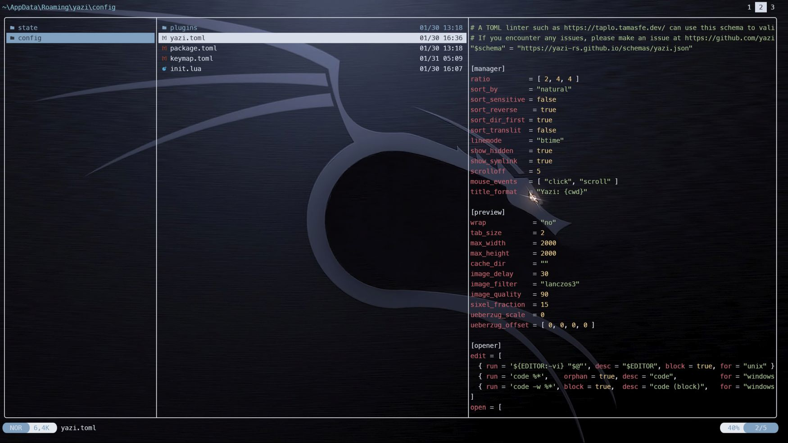

# Yazi  

<!-- toc -->

Tabbed file manager with preview supporting numerous file types.  

The install instructions are [here](https://yazi-rs.github.io/docs/installation). Don't forget to add the shell wrapper.  [Plugins](https://github.com/yazi-rs/plugins/tree/main) are also available.  

Add a shortcut `!` to drop to the shell in current directory. Type `exit` to return to yazi. Add this keybinding to your keymap.toml file:

```toml
[[manager.prepend_keymap]]
on   = "!"
run  = 'shell "pwsh.exe" --block'
desc = "Open PowerShell here"
```

[mpv](https://mpv.io/installation/) for video playback is recommended. Edit yazi.toml accordingly.  

  

> [!TIP]  
> For all keybindings, see the default keymap.toml file.

## Navigation  

To navigate between files and directories you can use the arrow keys <kbd>←</kbd>, <kbd>↓</kbd>, <kbd>↑</kbd> and <kbd>→</kbd> or Vim-like keys such as <kbd>h</kbd>, <kbd>j</kbd>, <kbd>k</kbd>, <kbd>l</kbd>:

| Key binding  | Alternate key | Action                                          |
| ------------ | ------------- | ----------------------------------------------- |
| <kbd>k</kbd> | <kbd>↑</kbd>  | Move the cursor up                              |
| <kbd>j</kbd> | <kbd>↓</kbd>  | Move the cursor down                            |
| <kbd>l</kbd> | <kbd>→</kbd>  | Enter hovered directory                         |
| <kbd>h</kbd> | <kbd>←</kbd>  | Leave the current directory and into its parent |

Further navigation commands can be found in the table below.

| Key binding                 | Action                                         |
| --------------------------- | ---------------------------------------------- |
| <kbd>K</kbd>                | Seek up 5 units in the preview                 |
| <kbd>J</kbd>                | Seek down 5 units in the preview               |
| <kbd>g</kbd> ⇒ <kbd>g</kbd> | Move cursor to the top                         |
| <kbd>G</kbd>                | Move cursor to the bottom                      |
| <kbd>z</kbd>                | Jump to a directory using zoxide               |
| <kbd>Z</kbd>                | Jump to a directory or reveal a file using fzf |

## Selection  

To select files and directories, the following commands are available.

| Key binding                    | Action                                     |
| ------------------------------ | ------------------------------------------ |
| <kbd>Space</kbd>               | Toggle selection of hovered file/directory |
| <kbd>v</kbd>                   | Enter visual mode (selection mode)         |
| <kbd>V</kbd>                   | Enter visual mode (unset mode)             |
| <kbd>Ctrl</kbd> + <kbd>a</kbd> | Select all files                           |
| <kbd>Ctrl</kbd> + <kbd>r</kbd> | Inverse selection of all files             |
| <kbd>Esc</kbd>                 | Cancel selection                           |

## File operations  

To interact with selected files/directories use any of the commands below.

| Key binding                         | Action                                                                  |
| ----------------------------------- | ----------------------------------------------------------------------- |
| <kbd>o</kbd>                        | Open selected files                                                     |
| <kbd>O</kbd>                        | Open selected files interactively                                       |
| <kbd>Enter</kbd>                    | Open selected files                                                     |
| <kbd>Shift</kbd> + <kbd>Enter</kbd> | Open selected files interactively (some terminals don't support it yet) |
| <kbd>Tab</kbd>                      | Show the file information                                               |
| <kbd>y</kbd>                        | Yank selected files (copy)                                              |
| <kbd>x</kbd>                        | Yank selected files (cut)                                               |
| <kbd>p</kbd>                        | Paste yanked files                                                      |
| <kbd>P</kbd>                        | Paste yanked files (overwrite if the destination exists)                |
| <kbd>Y</kbd> or <kbd>X</kbd>        | Cancel the yank status                                                  |
| <kbd>d</kbd>                        | Trash selected files                                                    |
| <kbd>D</kbd>                        | Permanently delete selected files                                       |
| <kbd>a</kbd>                        | Create a file (ends with / for directories)                             |
| <kbd>r</kbd>                        | Rename selected file(s)                                                 |
| <kbd>.</kbd>                        | Toggle the visibility of hidden files                                   |

Further file operation commands can be found in the table below.

| Key binding                    | Action                                     |
| ------------------------------ | ------------------------------------------ |
| <kbd>;</kbd>                   | Run a shell command                        |
| <kbd>:</kbd>                   | Run a shell command (block until finishes) |
| <kbd>-</kbd>                   | Symlink the absolute path of yanked files  |
| <kbd>_</kbd>                   | Symlink the relative path of yanked files  |
| <kbd>Ctrl</kbd> + <kbd>-</kbd> | Hardlink yanked files                      |

## Copy paths  

To copy paths, use any of the following commands below.

*Observation: <kbd>c</kbd> ⇒ <kbd>d</kbd> indicates pressing the <kbd>c</kbd> key followed by pressing the <kbd>d</kbd> key.*

| Key binding                 | Action                              |
| --------------------------- | ----------------------------------- |
| <kbd>c</kbd> ⇒ <kbd>c</kbd> | Copy the file path                  |
| <kbd>c</kbd> ⇒ <kbd>d</kbd> | Copy the directory path             |
| <kbd>c</kbd> ⇒ <kbd>f</kbd> | Copy the filename                   |
| <kbd>c</kbd> ⇒ <kbd>n</kbd> | Copy the filename without extension |

## Filter files  

| Key binding  | Action       |
| ------------ | ------------ |
| <kbd>f</kbd> | Filter files |

## Find files  

| Key binding  | Action                   |
| ------------ | ------------------------ |
| <kbd>/</kbd> | Find next file           |
| <kbd>?</kbd> | Find previous file       |
| <kbd>n</kbd> | Go to the next found     |
| <kbd>N</kbd> | Go to the previous found |

## Search files  

| Key binding                    | Action                                                                         |
| ------------------------------ | ------------------------------------------------------------------------------ |
| <kbd>s</kbd>                   | Search files by name using [fd](https://github.com/sharkdp/fd)                 |
| <kbd>S</kbd>                   | Search files by content using [ripgrep](https://github.com/BurntSushi/ripgrep) |
| <kbd>Ctrl</kbd> + <kbd>s</kbd> | Cancel the ongoing search                                                      |

## Sorting  

To sort files/directories use the following commands.

*Observation: <kbd>,</kbd> ⇒ <kbd>a</kbd> indicates pressing the <kbd>,</kbd> key followed by pressing the <kbd>a</kbd> key.*

| Key binding                 | Action                           |
| --------------------------- | -------------------------------- |
| <kbd>,</kbd> ⇒ <kbd>m</kbd> | Sort by modified time            |
| <kbd>,</kbd> ⇒ <kbd>M</kbd> | Sort by modified time (reverse)  |
| <kbd>,</kbd> ⇒ <kbd>b</kbd> | Sort by birth time               |
| <kbd>,</kbd> ⇒ <kbd>B</kbd> | Sort by birth time (reverse)     |
| <kbd>,</kbd> ⇒ <kbd>e</kbd> | Sort by file extension           |
| <kbd>,</kbd> ⇒ <kbd>E</kbd> | Sort by file extension (reverse) |
| <kbd>,</kbd> ⇒ <kbd>a</kbd> | Sort alphabetically              |
| <kbd>,</kbd> ⇒ <kbd>A</kbd> | Sort alphabetically (reverse)    |
| <kbd>,</kbd> ⇒ <kbd>n</kbd> | Sort naturally                   |
| <kbd>,</kbd> ⇒ <kbd>N</kbd> | Sort naturally (reverse)         |
| <kbd>,</kbd> ⇒ <kbd>s</kbd> | Sort by size                     |
| <kbd>,</kbd> ⇒ <kbd>S</kbd> | Sort by size (reverse)           |
| <kbd>,</kbd> ⇒ <kbd>r</kbd> | Sort randomly                    |

## Multi-tab  

| Key binding                                   | Action                             |
| --------------------------------------------- | ---------------------------------- |
| <kbd>t</kbd>                                  | Create a new tab with CWD          |
| <kbd>1</kbd>, <kbd>2</kbd>, ..., <kbd>9</kbd> | Switch to the N-th tab             |
| <kbd>[</kbd>                                  | Switch to the previous tab         |
| <kbd>]</kbd>                                  | Switch to the next tab             |
| <kbd>{</kbd>                                  | Swap current tab with previous tab |
| <kbd>}</kbd>                                  | Swap current tab with next tab     |
| <kbd>Ctrl</kbd> + <kbd>c</kbd>                | Close the current tab              |
